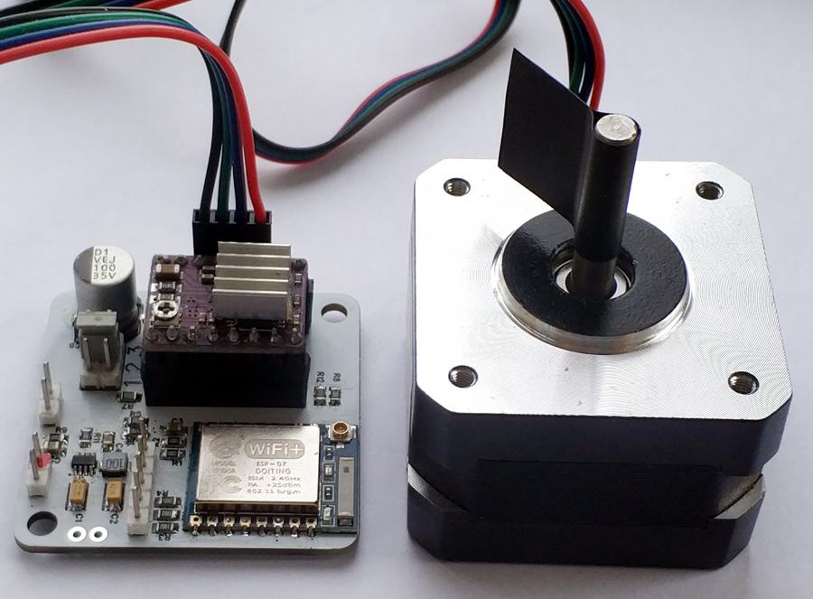

# LazyRolls with NEMA17

Поддержка Step/Dir драйверов шаговых двигателей добавлена с версии v0.10 прошивки.\
Step/Dir drivers support added to v0.10 firmware.

### Подключение / Wiring

Enable - GPIO4\
Step - GPIO13\
Dir - GPIO12

### Плата / Board

Размер платы равен размеру мотора NEMA17, 42х42мм\
Board size equal to NEMA17 motor size, 42x42mm
